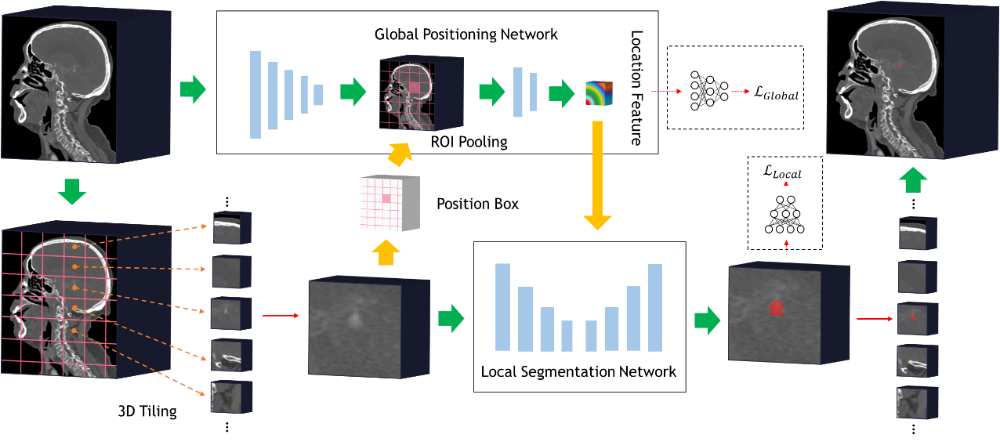

# GLIA-Net: Global Localization based Intracranial Aneurysm Network

This is the official repository of GLIA-Net, a segmentation network for 
intracranial aneurysm on CTA images using pytorch. 
If you find it useful in your research, please cite our paper: https://doi.org/10.1016/j.patter.2020.100197



## License
The code is licensed for non-commerical academic research purpose only.

## Requirements
The project has been tested in both Windows 10 and Ubuntu 16.04 using python 3.6.
But the training and evaluation code cannot use multi-processing on windows.
Other packages can be installed using pip or conda.

* torch>=1.4
* torchvision
* tensorboardX
* medpy
* SimpleITK>=2.0.0rc1
* PyYAML
* pillow
* colorlog


## Prepare data
If you want to train your model, put the data in `medical_data/` and 
prepare an instance information file like `medical_data/aneurysm_seg.csv`.
All the images should be in nii.gz format.

## Train
Prepare a training configuration file like `configs/GLIA-Net.yaml`.
Then run
```
python train.py -c GLIA-Net
```
The logs, checkpoints, summaries and other running assets will be saved to `exp/`.

Or you can download a pretrained model - [checkpoint-0245700.pt](https://github.com/MeteorsHub/GLIA-Net/releases/download/v1.0/checkpoint-0245700.pt).
Then put it to `exp/GLIA-Net/1/ckpt`.

## Evaluation
Prepare an evaluation configuration file like `configs/eval_GLIA-Net.yaml`, 
which should have a filename prefix of 'eval_'.
Then run
```
python evaluate.py -c eval_GLIA-Net
```
Not that this is an evaluation on patches, which depends on how to generate all patches.
If you want to evaluate on whole cases, run the inference code to generate predictions and then
```
python evaluate_per_case.py \
    -c eval_per_case \
    -g path/to/ground_truth \
    -p path/to/predictions
```

## View the tensorboard
You can view the training and evaluation information using tensorboard.
Run `tensorboard --logdir=exp` to run a tensorboard server.

## Inference
Prepare an inference configureation file like `configs/inference_GLIA-Net.yaml`,
which should have a filename prefix of 'inference_'.
Then run
```
python inference.py \
    -c inference_GLIA-Net \
    -i path/to/input/file/or/folder \
    -t nii
    -o path/to/save/predictions
```
The inference code support single or multiple input images and image format of nii.gz or dicom series.
If you want to refine the predictions, run the code
```
python refine_segmenation.py \
    -i path/to/predictions/before/refine \
    -o path/to/save/refined/predictions
```

## Advanced functions
The code support other functions like different devices by setting `-d` to "cpu", "0", or "1,2,3"...,
multi-thread and multi-process data pipeline, and so on.

You can refer to the input argument instructions in `train.py`, `evaluation.py` and `inference.py`.
You can also modify the configurations in `configs/`.

The training code using batch_size of 1 shall require about 3GB of memory. 
You can increase the batch size according to your memory capacity.
